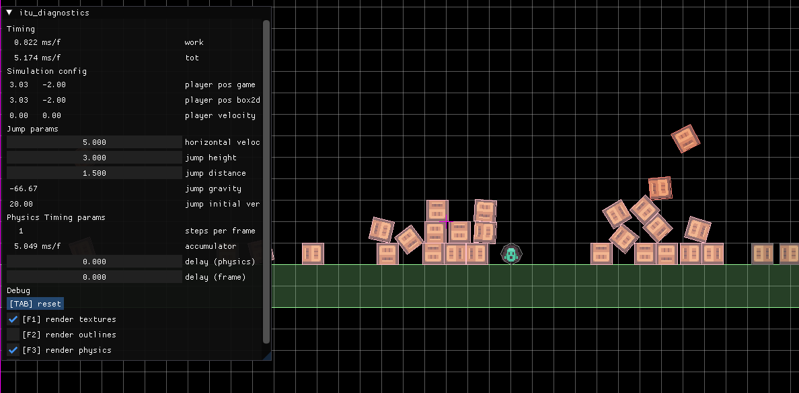

# Game Programming 26
Repository for the IT University of Copenhagen Game Programming course.



You are free to use any development setup you want, as long as you can confortably build and debug CMake projects. Below, yout will find a [simple self-contained setup](#simple-self-contained-setup) using Visual Studio Code, or a [command line setup](#command-line-setup) if you have your favourite environment and you just want to be able to run the exercises faster

## Before the course start
- [ ] setup and test your development environment
- [ ] build and run the files in the `examples` folder
- [ ] be sure you are familiar with the basics of C/C++ (syntax, control flow, variable and functions, structs/arrays/enums/unions/, pointers). You can check the [course page](https://learnit.itu.dk/course/view.php?id=3025983) for additional resources on this
- [ ] refresh a bit of linear algebra and trigonometry

Should you have problems regarding missing SDL dependencies, you can find what you're missing at SDL's README pages([win](https://wiki.libsdl.org/SDL3/README-windows), [linux](https://wiki.libsdl.org/SDL3/README-linux#build-dependencies), [macos](https://wiki.libsdl.org/SDL3/README-macos))
I've setu up a folder for you (`playground`) if you want to test things out. Just create a `.cpp` file in there and reconfigure the CMake project, and you can try everything that doesn't involve external dependencies.

## Download
Clone the exercise repository
```sh
git clone --recurse-submodules https://github.com/Chris-Carvelli/game-programming-26.git
```

## Simple Self-contained Setup
1. download and install [CMake](https://cmake.org/download/) (for mac users, use [brew](https://brew.sh/) instead of downloading from the website)
2. download [VSCode](https://code.visualstudio.com/download) and install these two extensions (both of them from Microsoft)
    1. C/C++ Extension Pack 
    2. CMake Tools
3. open repository in VSCode
4. in `Preferences->Settings`, search for `cmake path` and replace the content with the path to your CMake executable (you can find in typing `where cmake` or `which cmake` on the command line)
5. restart the editor

After reopening the editor, you should see all available targets in the cmake tab, in the `Project Outline` section.

Build and run them from there, or set one to be the "default" target (`right-click->Set Launch/Debug Target`)

## Command Line Setup
Download and install [CMake](https://cmake.org/download/) (for mac users, use [brew](https://brew.sh/) instead of downloading from the website) and be sure it's added to your PATH.
Then execute these commands from the root of this repository:

```sh
mkdir build
cd build
cmake .. -DCMAKE_BUILD_TYPE=Debug # you'll definitely want debug info during the course
cmake --build .
```

The executables will be generated in the `build` folder, with the same name as the file that generated them.
